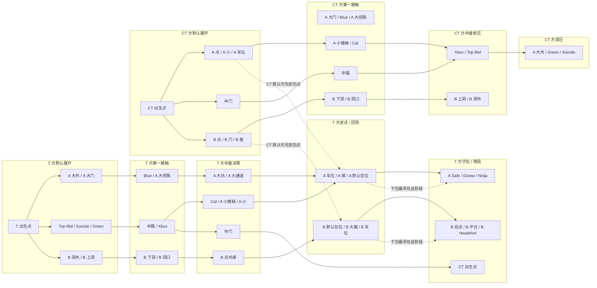
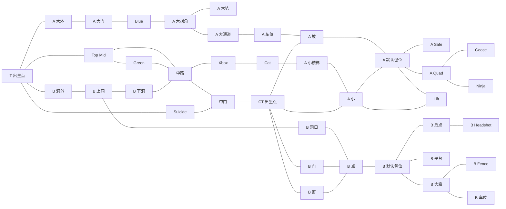

# Dust2 节点连接图

## 1. 文档定位

这份文档是 Dust2 节点化回合引擎的人工审阅版。

机器可读版本见：

```text
data/materials/processed/maps/dust2/node-graph.json
```

目标是固定 Dust2 重要位置与连接关系，避免后续 LLM 根据模糊区名自行猜测地图拓扑。

## 2. 使用原则

- 节点是状态容器，不是字符串。
- 边表示常规可达或可交火连接，不表示行动一定成功。
- 每回合只激活 3-5 个关键节点及其相邻节点。
- 未激活节点保持轻量状态，不要求每个时间点全图更新。
- 商业语义必须跟随节点冲突进入回合，而不是赛后贴皮。
- 图不仅约束“能不能到”，也约束“当前时间点最远能到哪里”。

## 3. 时间点与可达性

本模型不追求精确秒表跑图，但必须约束阶段可达性。

核心原则：

```text
T 方开局离包点更远。
CT 方开局天然更接近 A 点、B 点、中门、A 小、B 门、B 窗等防守位置。
默认展开阶段不能写 T 方已经站进包点或完成下包。
跨越不相邻节点必须经过 graph 中的中间节点。
```

### 3.1 时间阶段

| 阶段 | 含义 |
|---|---|
| 默认展开 | 开局站位、默认控图、经济买型、商业计划开局部署。 |
| 第一接触 | A 大、中路、B 洞等前沿区域发生信息交换或首次交火。 |
| 中盘决策 | 转点、夹击、重新集合、资源再分配。 |
| 进点 / 回防 | 进攻方进入包点或防守方开始回防。 |
| 守包 / 拆包 / 残局 | 下包后守包、拆包、残局、保枪或最终全歼。 |

### 3.2 T 方阶段可达

| 阶段 | 常规可达节点 |
|---|---|
| 默认展开 | T 出生点、A 大外、A 大门、Top Mid、Suicide、Green、B 洞外、B 上洞 |
| 第一接触 | Blue、A 大拐角、中路、Xbox、B 下洞、B 洞口 |
| 中盘决策 | A 大坑、A 大通道、Cat、A 小楼梯、A 小、中门、B 点 |
| 进点 / 回防 | A 车位、A 坡、A 默认包位、A Quad、Lift、B 默认包位、B 大箱、B 车位、B 门、B 窗 |
| 守包 / 拆包 / 残局 | A Safe、Goose、Ninja、B 后点、B 平台、B Fence、B Headshot、CT 出生点 |

### 3.3 CT 方阶段可达

| 阶段 | 常规可达节点 |
|---|---|
| 默认展开 | CT 出生点、中门、A 小、A 坡、A 默认包位、A Safe、A Quad、Goose、Ninja、Lift、A 车位、B 门、B 窗、B 点、B 默认包位、B 后点、B 平台、B 大箱、B Fence、B 车位、B Headshot |
| 第一接触 | A 大门、Blue、A 大拐角、A 大坑、A 大通道、A 小楼梯、Cat、中路、B 下洞、B 洞口 |
| 中盘决策 | Xbox、Top Mid、B 上洞、B 洞外 |
| 进点 / 回防 | A 大外、Green、Suicide |
| 守包 / 拆包 / 残局 | T 出生点 |

### 3.4 硬约束

这些约束后续应进入 prompt、normalizer 或 validator：

- 默认展开阶段，T 方不能声称已经到达 A 默认包位、B 默认包位或完成下包。
- 默认展开阶段，CT 方可以已经在 A 点、B 点、中门、A 小、B 门、B 窗等防守位置建立默认站位。
- T 方进入包点通常不得早于进点 / 回防阶段；快攻也必须先经过前沿接触节点。
- 下包、拆包、守包和包炸只能发生在进点 / 回防或守包 / 拆包 / 残局阶段。
- 如果 agent 想从两个不相邻节点移动，必须经过 graph 中的中间节点。

### 3.5 阶段可达图

这张图专门表达时空关系：同一个地图节点不是任何时间都能被任何一方写入。



读图规则：

- T 方从左到右推进，默认展开阶段只能到前沿节点。
- CT 方默认展开阶段已经可以在 A 点、B 点和中门建立防守。
- 虚线表示规则提示，不表示路线。
- 如果 LLM 在默认展开阶段写 T 方已经下包，应被判为不合法。

## 4. Dust2 总图



## 5. 主路线

### 5.1 A 大正面路线

```text
T 出生点 -> A 大外 -> A 大门 -> Blue -> A 大拐角 -> A 大通道 -> A 车位 -> A 坡 -> A 默认包位
```

商业语义：

```text
用正面强主张争夺最主流机会场景。
```

### 5.2 A 小精准切口路线

```text
T 出生点 -> Top Mid -> 中路 -> Xbox -> Cat -> A 小楼梯 -> A 小 -> A 默认包位
```

商业语义：

```text
从 buyer 信息争夺转入精准切口，打关键使用者或关键时机。
```

### 5.3 中路信息路线

```text
T 出生点 -> Top Mid -> 中路 -> 中门 -> CT 出生点
```

商业语义：

```text
争夺用户定义和对手组织响应信息。
```

### 5.4 B 洞侧翼路线

```text
T 出生点 -> B 洞外 -> B 上洞 -> B 洞口 -> B 点 -> B 默认包位
```

商业语义：

```text
打被主流忽略但更锋利的侧翼场景。
```

### 5.5 中路夹 B 路线

```text
T 出生点 -> Top Mid -> 中路 -> 中门 -> CT 出生点 -> B 门 -> B 点
```

商业语义：

```text
通过中路信息突破组织防线，再夹击备用落点。
```

### 5.6 B 洞转中路线

```text
B 洞外 -> B 上洞 -> B 下洞 -> 中路 -> Xbox -> Cat
```

商业语义：

```text
侧翼计划受阻后转入 buyer 信息争夺或 A 小切口。
```

## 6. 包点内部组

### 6.1 A 点内部

```text
A 坡
A 默认包位
A Safe
A Quad
Goose
Ninja
Lift
A 车位
A 小
```

### 5.2 B 点内部

```text
B 点
B 默认包位
B 后点
B 平台
B 大箱
B Fence
B 车位
B Headshot
B 窗
B 门
```

## 7. 当前工程 zone 映射

| 细节点组 | 当前工程 zoneId | 对外显示 |
|---|---|---|
| T 出生点 | `spawn_a` | T 出生点 |
| CT 出生点 | `spawn_b` | CT 出生点 |
| 中路 / Top Mid / Xbox / 中门 | `buyer_mid` | 中路 |
| A 点内部 | `conversion_site_a` | A 点 |
| B 点内部 | `conversion_site_b` | B 点 |
| A 大路线 | `pricing_ramp` | A 大 |
| A 小路线 | `retention_connector` | A 小 |
| B 洞路线 | `token_economy` | B 洞 |

说明：

```text
token_economy 只保留为历史内部 alias，对外必须显示为 B 洞。
```

## 8. 后续实现注意事项

- LLM prompt 只能引用本图存在的节点和边。
- 如果 agent 想从两个不相邻节点移动，必须经过中间节点。
- 如果局部裁判写出不存在的路线，应被 normalizer 或 validator 拦截。
- 如果局部裁判写出当前时间点不可达的节点，应被 normalizer 或 validator 降级、修正或拒绝。
- 每个时间点只更新活跃节点，不要求全图刷新。
- 地图图结构只约束空间合法性，不直接决定 winner。
