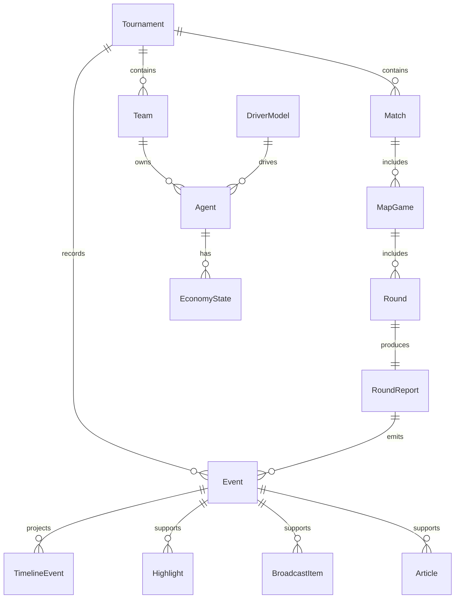

# P0.1 领域模型（Domain Schema）

## 1. 文档定位

这份文档定义 Agent Major 的基础领域对象。它回答的问题是：

```text
系统里有哪些核心对象？
这些对象之间如何关联？
哪些对象是事实源，哪些对象是派生物？
哪些字段现在必须稳定，哪些细节留给后续专项文档？
```

这不是数据库表设计，不是 API 文档，也不是最终 TypeScript / Zod 实现。它是后续文档和工程实现共同遵守的对象契约。

## 2. 设计原则

### 2.1 骨架优先

P0.1 只负责让系统有清晰骨架。后续专项文档负责让骨架长出细节。

```text
P0.1 定义对象、关系、边界、扩展入口。
P0.2 定义完整事件分类。
P1.1 定义完整回合战报结构。
P1.2 定义完整 Token 经济规则。
后续专项文档定义完整智能体参数体系。
```

### 2.2 边界明确

必须守住三条边界：

```text
智能体（Agent）是比赛角色。
大模型驾驶员（DriverModel）是执行引擎。

事件（Event）是事实源。
时间线事件（TimelineEvent）是播放投影。

经济状态（EconomyState）是比赛内资源。
真实 API token / 成本是运维指标。
```

### 2.3 保留扩展接口

P0.1 不把未来细化内容写死，但要给未来扩展预留稳定接口。

例如：

```text
Agent 通过 parameterProfileId 连接未来智能体参数体系。
RoundReport 通过 keyEvents 连接事件、2D 地图、击杀播报、解说、弹幕、支持率。
Event 通过 payload 承载不同事件类型的结构化载荷。
TimelineEvent 通过 sourceEventIds 追溯事实来源。
```

## 3. 命名约定

### 3.1 文档表达

- 中文名词优先。
- 英文术语放在括号内。
- 代码字段使用 `camelCase`。

### 3.2 ID 约定

- 所有核心实体都必须有稳定 `id`。
- P0.1 只规定 `id` 是稳定引用，不规定 UUID、前缀 ID 或数据库自增。
- 外键字段使用 `xxxId`，例如 `teamId`、`matchId`、`mapGameId`。

### 3.3 时间字段

通用时间字段：

```text
createdAt
updatedAt
startedAt
completedAt
```

不是所有实体都必须拥有全部时间字段。是否需要由实体生命周期决定。

### 3.4 状态字段

通用状态字段：

```text
status
```

状态枚举只在 P0.1 列基础值，完整状态机由后续引擎文档细化。

## 4. 实体分类

### 4.1 核心实体

核心实体是 P0.1 必须定义的系统骨架：

```text
赛事（Tournament）
队伍（Team）
智能体（Agent）
大模型驾驶员（DriverModel）
比赛（Match）
地图局（MapGame）
回合（Round）
回合战报（RoundReport）
经济状态（EconomyState）
事件（Event）
时间线事件（TimelineEvent）
```

### 4.2 派生实体

派生实体在 P0.1 只定义用途和关系，不展开完整字段：

```text
摘要（Summary）
高光（Highlight）
转播条目（BroadcastItem）
奖项（Award）
新闻文章（Article）
产物文件（Artifact）
```

## 5. 核心实体定义

### 5.1 赛事（Tournament）

定义：一届 Agent Major 赛事，是所有队伍、比赛、事件和产物的顶层容器。

事实源：是。

| 中文字段 | 代码字段 | 类型草案 | 必填 | 说明 |
|---|---|---|---|---|
| 赛事 ID | `id` | `string` | 是 | 稳定引用 ID。 |
| 赛事名称 | `name` | `string` | 是 | 例如 `Agent Major: Champions Bracket`。 |
| 赛事状态 | `status` | `TournamentStatus` | 是 | 基础值见基础枚举。 |
| 赛制类型 | `format` | `TournamentFormat` | 是 | 第一版默认 16 队单败。 |
| 创建时间 | `createdAt` | `string` | 是 | ISO 时间字符串。 |
| 开始时间 | `startedAt` | `string` | 否 | 赛事启动后写入。 |
| 完成时间 | `completedAt` | `string` | 否 | 赛事结束后写入。 |
| 冠军队伍 ID | `championTeamId` | `string` | 否 | 赛事完成后写入。 |

上游来源：

- 管理与控制台（Admin & Control Panel）
- 赛事领域（Tournament Domain）

下游消费者：

- 比赛模拟引擎（Simulation Engine）
- 事件日志（Event Log）
- 数据统计与奖项（Stats & Awards）
- 新闻与媒体（News & Media）

关键约束：

- 一个 Tournament 是赛事级事实边界。
- 所有 Match、Team、Event 都必须能追溯到 Tournament。

### 5.2 队伍（Team）

定义：参加赛事的一支幽灵战队。

事实源：是。

| 中文字段 | 代码字段 | 类型草案 | 必填 | 说明 |
|---|---|---|---|---|
| 队伍 ID | `id` | `string` | 是 | 稳定引用 ID。 |
| 所属赛事 ID | `tournamentId` | `string` | 是 | 指向 Tournament。 |
| 展示名称 | `displayName` | `string` | 是 | 页面和转播显示名。 |
| 短名称 | `shortName` | `string` | 是 | 比分牌、地图 UI 使用。 |
| 种子顺位 | `seed` | `number` | 是 | 用于生成对阵。 |
| 队伍来源 | `source` | `TeamSource` | 否 | 手动导入、HLTV / Valve 灵感来源等。 |
| 队伍基因 | `teamProfileId` | `string` | 否 | 连接未来队伍风格参数体系。 |
| 创建时间 | `createdAt` | `string` | 是 | ISO 时间字符串。 |
| 更新时间 | `updatedAt` | `string` | 否 | 队伍信息更新后写入。 |

上游来源：

- 素材与导入（Materials & Imports）
- 幽灵战队转译（Ghost Conversion）

下游消费者：

- 对阵树（Bracket）
- 比赛模拟引擎（Simulation Engine）
- 转播与伪直播（Broadcast & Pseudo Live）
- 数据统计与奖项（Stats & Awards）

关键约束：

- Team 不直接绑定大模型。
- Team 的风格细节不在 P0.1 展开，通过 `teamProfileId` 预留扩展。

### 5.3 智能体（Agent）

定义：赛事里的选手人格、职责、战术位置和当前状态。

事实源：是。

智能体不是大模型本身。智能体通过 `driverModelId` 绑定一个大模型驾驶员，通过 `parameterProfileId` 连接未来精细化参数体系。

| 中文字段 | 代码字段 | 类型草案 | 必填 | 说明 |
|---|---|---|---|---|
| 智能体 ID | `id` | `string` | 是 | 稳定引用 ID。 |
| 所属队伍 ID | `teamId` | `string` | 是 | 指向 Team。 |
| 驾驶员模型 ID | `driverModelId` | `string` | 是 | 指向 DriverModel。 |
| 参数档案 ID | `parameterProfileId` | `string` | 否 | 连接未来智能体精细化参数。 |
| 角色 | `role` | `AgentRole` | 是 | 教练、指挥、突破手等。 |
| 展示名称 | `displayName` | `string` | 是 | 转播、面板、统计使用。 |
| 基础档案 | `baseProfile` | `AgentBaseProfile` | 是 | 只放基础可读信息。 |
| 当前状态 | `currentState` | `AgentState` | 是 | 火热、低迷、低经济等基础状态。 |
| 创建时间 | `createdAt` | `string` | 是 | ISO 时间字符串。 |
| 更新时间 | `updatedAt` | `string` | 否 | 智能体基础信息更新后写入。 |

`baseProfile` 只包含基础可读信息：

| 中文字段 | 代码字段 | 类型草案 | 必填 | 说明 |
|---|---|---|---|---|
| 人格摘要 | `personalitySummary` | `string` | 是 | 简短描述智能体人格。 |
| 战术定位摘要 | `tacticalSummary` | `string` | 是 | 简短描述战术位置。 |
| 风格标签 | `styleTags` | `string[]` | 是 | 例如激进、稳健、反制。 |
| 优势摘要 | `strengthSummary` | `string` | 否 | 不展开能力参数。 |
| 弱点摘要 | `weaknessSummary` | `string` | 否 | 不展开能力参数。 |

上游来源：

- 队伍与智能体领域（Team & Agent Domain）
- 素材与导入（Materials & Imports）
- 大模型驾驶员层（LLM Driver Layer）

下游消费者：

- 比赛模拟引擎（Simulation Engine）
- 大模型驾驶员层（LLM Driver Layer）
- 转播与伪直播（Broadcast & Pseudo Live）
- 数据统计与奖项（Stats & Awards）

关键约束：

- Agent 是比赛角色，不是模型。
- `driverModelId` 用于绑定执行引擎，不进入第一版经济平衡。
- `parameterProfileId` 是未来扩展入口，P0.1 不展开完整智能体参数体系。
- 精细化参数后续可覆盖能力、战术倾向、经济行为、地图偏好、状态波动、输出风格等。

### 5.4 大模型驾驶员（DriverModel）

定义：驱动智能体、裁判、解说、弹幕、新闻等任务的底层大模型配置。

事实源：配置对象。

| 中文字段 | 代码字段 | 类型草案 | 必填 | 说明 |
|---|---|---|---|---|
| 驾驶员模型 ID | `id` | `string` | 是 | 稳定引用 ID。 |
| 模型供应商 | `provider` | `ModelProvider` | 是 | 例如 OpenAI、Kimi、Qwen。 |
| 模型名称 | `modelName` | `string` | 是 | 具体模型名。 |
| 能力标签 | `capabilities` | `string[]` | 是 | 例如推理、结构化、长上下文。 |
| 限制信息 | `limits` | `DriverModelLimits` | 否 | 上下文、输出、速率等限制。 |
| 默认用途 | `defaultUseCase` | `DriverUseCase[]` | 否 | agent、judge、caster、barrage、news 等。 |
| 是否启用 | `enabled` | `boolean` | 是 | 本地可关闭某些模型。 |

上游来源：

- 大模型驾驶员层（LLM Driver Layer）
- 管理与控制台（Admin & Control Panel）

下游消费者：

- 智能体（Agent）
- 裁判与评分（Judge & Scoring）
- 转播与伪直播（Broadcast & Pseudo Live）
- 新闻与媒体（News & Media）
- 可观测性与成本控制（Observability & Cost Control）

关键约束：

- DriverModel 可以影响输出风格和执行质量。
- DriverModel 不直接成为比赛经济资源。
- 真实 API 成本只进入可观测性与成本控制，不进入 EconomyState。

### 5.5 比赛（Match）

定义：两支队伍之间的一场三局两胜系列赛（BO3）。

事实源：是。

| 中文字段 | 代码字段 | 类型草案 | 必填 | 说明 |
|---|---|---|---|---|
| 比赛 ID | `id` | `string` | 是 | 稳定引用 ID。 |
| 所属赛事 ID | `tournamentId` | `string` | 是 | 指向 Tournament。 |
| 轮次名称 | `roundName` | `MatchRoundName` | 是 | 16 强、8 强、半决赛、决赛。 |
| A 队 ID | `teamAId` | `string` | 是 | 指向 Team。 |
| B 队 ID | `teamBId` | `string` | 是 | 指向 Team。 |
| 比赛状态 | `status` | `MatchStatus` | 是 | 基础值见基础枚举。 |
| 最多地图数 | `bestOf` | `number` | 是 | 第一版固定为 3。 |
| A 队地图胜场 | `teamAMapsWon` | `number` | 是 | BO3 当前比分。 |
| B 队地图胜场 | `teamBMapsWon` | `number` | 是 | BO3 当前比分。 |
| 胜者队伍 ID | `winnerTeamId` | `string` | 否 | 比赛完成后写入。 |
| 赛程顺序 | `scheduledOrder` | `number` | 是 | 用于展示和推进。 |

上游来源：

- 赛事领域（Tournament Domain）
- 对阵树（Bracket）

下游消费者：

- 比赛模拟引擎（Simulation Engine）
- 地图局（MapGame）
- 事件日志（Event Log）
- 数据统计与奖项（Stats & Awards）

关键约束：

- Match 不直接保存全部回合事实。
- Match 的事实细节通过 MapGame、Round、RoundReport、Event 追溯。

### 5.6 地图局（MapGame）

定义：一场 Match 中的一张地图。

事实源：是。

| 中文字段 | 代码字段 | 类型草案 | 必填 | 说明 |
|---|---|---|---|---|
| 地图局 ID | `id` | `string` | 是 | 稳定引用 ID。 |
| 所属比赛 ID | `matchId` | `string` | 是 | 指向 Match。 |
| 地图名称 | `mapName` | `string` | 是 | 例如 `DUST2`。 |
| 地图顺序 | `order` | `number` | 是 | BO3 第几张图。 |
| 地图状态 | `status` | `MapGameStatus` | 是 | 基础值见基础枚举。 |
| A 队比分 | `teamAScore` | `number` | 是 | 当前地图比分。 |
| B 队比分 | `teamBScore` | `number` | 是 | 当前地图比分。 |
| 当前回合号 | `currentRoundNumber` | `number` | 是 | 用于推进地图。 |
| 胜者队伍 ID | `winnerTeamId` | `string` | 否 | 地图结束后写入。 |
| 地图摘要 ID | `summaryId` | `string` | 否 | 指向 Summary。 |

上游来源：

- 比赛模拟引擎（Simulation Engine）
- 地图禁选（Veto）

下游消费者：

- 回合（Round）
- 经济状态（EconomyState）
- 事件日志（Event Log）
- 2D 战术渲染器（2D Tactical Renderer）

关键约束：

- MapGame 只存地图级状态。
- 地图内每回合事实由 Round、RoundReport、Event 记录。

### 5.7 回合（Round）

定义：地图局里的一个比赛回合，是模拟引擎推进的最小同步单位。

事实源：是。

| 中文字段 | 代码字段 | 类型草案 | 必填 | 说明 |
|---|---|---|---|---|
| 回合 ID | `id` | `string` | 是 | 稳定引用 ID。 |
| 所属地图局 ID | `mapGameId` | `string` | 是 | 指向 MapGame。 |
| 回合号 | `roundNumber` | `number` | 是 | 地图内编号。 |
| 回合状态 | `status` | `RoundStatus` | 是 | 基础值见基础枚举。 |
| Agent 购买类型 | `buyTypeByAgent` | `Record<string, BuyType>` | 是 | 本回合 active Agent 的购买类型。 |
| A 队激活智能体 | `teamAActiveAgentIds` | `string[]` | 是 | 本回合实际出手的智能体。 |
| B 队激活智能体 | `teamBActiveAgentIds` | `string[]` | 是 | 本回合实际出手的智能体。 |
| 胜者队伍 ID | `winnerTeamId` | `string` | 否 | 裁判判定后写入。 |
| 回合战报 ID | `roundReportId` | `string` | 否 | 指向 RoundReport。 |
| 开始时间 | `startedAt` | `string` | 否 | 回合开始后写入。 |
| 完成时间 | `completedAt` | `string` | 否 | 回合完成后写入。 |

上游来源：

- 比赛模拟引擎（Simulation Engine）
- Token 经济系统（Token Economy）

下游消费者：

- 回合战报（RoundReport）
- 事件日志（Event Log）
- 数据统计与奖项（Stats & Awards）
- 转播与伪直播（Broadcast & Pseudo Live）

关键约束：

- Round 是同步模拟单位。
- Round 不保存完整自然语言过程，完整结构化结果由 RoundReport 承担。

### 5.8 回合战报（RoundReport）

定义：回合结束后的结构化战报，是从模拟结果到事件、转播、统计的桥梁。

事实源：是。

P0.1 只定义骨架，完整结构由 `P1.1 回合战报契约` 细化。

| 中文字段 | 代码字段 | 类型草案 | 必填 | 说明 |
|---|---|---|---|---|
| 回合战报 ID | `id` | `string` | 是 | 稳定引用 ID。 |
| 所属回合 ID | `roundId` | `string` | 是 | 指向 Round。 |
| 胜者队伍 ID | `winnerTeamId` | `string` | 是 | 本回合胜者。 |
| 回合后比分 | `scoreAfterRound` | `ScorePair` | 是 | 本回合结束后的地图比分。 |
| 关键事件 | `keyEvents` | `RoundKeyEvent[]` | 是 | 驱动事件、2D 地图、击杀播报。 |
| 经济变化 | `economyDelta` | `TeamDeltaPair` | 是 | 用于生成经济更新。 |
| 高光标签 | `highlightTags` | `string[]` | 否 | 用于高光候选。 |
| 裁判理由 | `judgeReason` | `string` | 是 | 结构化事实来源之一。 |
| 摘要 | `summary` | `string` | 是 | 简短自然语言战报。 |
| 创建时间 | `createdAt` | `string` | 是 | ISO 时间字符串。 |

上游来源：

- 比赛模拟引擎（Simulation Engine）
- 裁判与评分（Judge & Scoring）

下游消费者：

- 事件日志（Event Log）
- 2D 战术渲染器（2D Tactical Renderer）
- 击杀播报（Kill Feed）
- 转播与伪直播（Broadcast & Pseudo Live）
- 数据统计与奖项（Stats & Awards）

关键约束：

- RoundReport 必须是机器可消费结构。
- RoundReport 不能只保存自然语言。
- `keyEvents` 必须能追溯到回合、队伍、智能体和地图区域。
- 详细 key event 类型留给 P1.1。

### 5.9 经济状态（EconomyState）

定义：某个智能体在某张地图或某个回合前后的比赛内 token 经济状态。

事实源：是。

P0.1 只定义骨架，完整经济公式和策略由 `P1.2 Token 经济说明` 细化。

| 中文字段 | 代码字段 | 类型草案 | 必填 | 说明 |
|---|---|---|---|---|
| 经济状态 ID | `id` | `string` | 是 | 稳定引用 ID。 |
| 智能体 ID | `agentId` | `string` | 是 | 指向 Agent。 |
| 队伍 ID | `teamId` | `string` | 是 | 用于团队经济聚合展示。 |
| 地图局 ID | `mapGameId` | `string` | 是 | 指向 MapGame。 |
| 回合 ID | `roundId` | `string` | 否 | 可表示某回合前后状态。 |
| token 银行 | `tokenBank` | `number` | 是 | Agent 当前比赛内抽象资源。 |
| 购买类型 | `buyType` | `BuyType` | 是 | full buy、eco 等。 |
| 连败次数 | `lossStreak` | `number` | 是 | 经济补偿的输入之一。 |
| 可用暂停数 | `timeoutsRemaining` | `number` | 是 | 教练暂停资源。 |
| 可见上下文预算 | `visibleContextBudget` | `number` | 否 | 本回合可见比赛上下文预算，不代表真实 API 输入 token 上限。 |
| 输出预算 | `outputBudget` | `number` | 否 | 本回合可用输出预算。 |
| 创建时间 | `createdAt` | `string` | 是 | ISO 时间字符串。 |

上游来源：

- Token 经济系统（Token Economy）
- 回合结果（Round Result）

下游消费者：

- 比赛模拟引擎（Simulation Engine）
- 智能体（Agent）
- 回合（Round）
- 回合战报（RoundReport）
- 数据统计与奖项（Stats & Awards）

关键约束：

- EconomyState 表示 Agent 级比赛内资源，不代表真实 API 成本。
- 团队经济（Team economy）是队内 Agent tokenBank 的加总展示，不是购买主体。
- EconomyState 不决定切换哪个 DriverModel。
- 真实成本进入可观测性与成本控制，不进入 P0.1 的经济状态。

### 5.10 事件（Event）

定义：系统事实源，用于记录比赛、经济、裁判、转播包装和内容生成等发生过的事情。

事实源：是。

P0.1 只定义事件通用结构，完整事件类型和 payload 由 `P0.2 事件分类` 细化。

| 中文字段 | 代码字段 | 类型草案 | 必填 | 说明 |
|---|---|---|---|---|
| 事件 ID | `id` | `string` | 是 | 稳定引用 ID。 |
| 事件类型 | `type` | `EventType` | 是 | 完整枚举留给 P0.2。 |
| 所属赛事 ID | `tournamentId` | `string` | 是 | 指向 Tournament。 |
| 所属比赛 ID | `matchId` | `string` | 否 | 比赛相关事件必填。 |
| 所属地图局 ID | `mapGameId` | `string` | 否 | 地图相关事件必填。 |
| 所属回合 ID | `roundId` | `string` | 否 | 回合相关事件必填。 |
| 载荷 | `payload` | `unknown` | 是 | P0.2 定义具体结构。 |
| 全局事件序号 | `globalSequence` | `number` | 是 | 事实账本内的单调递增顺序，用于恢复、审计和导出。 |
| 作用域类型 | `scopeType` | `EventScopeType` | 是 | tournament / match / map / round。 |
| 作用域 ID | `scopeId` | `string` | 是 | 与 scopeType 对应的业务对象 ID。 |
| 作用域内序号 | `sequenceInScope` | `number` | 是 | 同一 scope 内的稳定顺序，回合内事件重放优先使用它。 |
| 时间线毫秒 | `timelineMs` | `number` | 否 | 用于伪直播播放排序。 |
| 创建时间 | `createdAt` | `string` | 是 | 事实写入时间。 |
| 来源模块 | `sourceModule` | `string` | 否 | 例如 simulation、judge、broadcast。 |

上游来源：

- 比赛模拟引擎（Simulation Engine）
- Token 经济系统（Token Economy）
- 裁判与评分（Judge & Scoring）
- 转播与伪直播（Broadcast & Pseudo Live）
- 新闻与媒体（News & Media）

下游消费者：

- 时间线事件（TimelineEvent）
- 数据统计与奖项（Stats & Awards）
- 新闻与媒体（News & Media）
- 管理与控制台（Admin & Control Panel）

关键约束：

- Event 是事实源。
- 派生内容必须能追溯到 Event。
- 事件不应被随意修改；如需修正，应通过补充事件或人工干预规则处理。

### 5.11 时间线事件（TimelineEvent）

定义：前端伪直播播放使用的事件投影。

事实源：否，是派生物。

TimelineEvent 从 Event 投影生成，不反写比赛事实。

| 中文字段 | 代码字段 | 类型草案 | 必填 | 说明 |
|---|---|---|---|---|
| 时间线事件 ID | `id` | `string` | 是 | 稳定引用 ID。 |
| 来源事件 ID 列表 | `sourceEventIds` | `string[]` | 是 | 追溯到 Event。 |
| 播放时间点 | `atMs` | `number` | 是 | 相对回合或地图的播放时间。 |
| 时间线类型 | `kind` | `TimelineEventKind` | 是 | 完整类型由伪直播文档细化。 |
| 载荷 | `payload` | `unknown` | 是 | 前端渲染所需数据。 |
| 创建时间 | `createdAt` | `string` | 是 | 投影生成时间。 |

上游来源：

- 事件日志（Event Log）
- 转播与伪直播（Broadcast & Pseudo Live）

下游消费者：

- 2D 战术渲染器（2D Tactical Renderer）
- 直播页（Live Page）
- 回放系统（Replay）

关键约束：

- TimelineEvent 不是事实源。
- TimelineEvent 可以重生成。
- TimelineEvent 不应被新闻、统计或裁判当作比赛事实。

## 6. 派生实体骨架

### 6.1 摘要（Summary）

用途：保存 round、map、match、team tactical memory 等压缩上下文。

来源：

- 摘要引擎（Summary Engine）
- 事件日志（Event Log）

下游：

- 比赛模拟引擎（Simulation Engine）
- 上下文构建器（Context Builder）
- 新闻与媒体（News & Media）

边界：

- Summary 是上下文燃料，不是不可变事实源。
- Summary 可以基于 Event 重新生成。

### 6.2 高光（Highlight）

用途：记录可回放、可展示、可进入榜单的精彩时刻。

来源：

- 回合战报（RoundReport）
- 事件日志（Event Log）
- 高光检测任务（Highlight Detection）

下游：

- 回放卡片（Replay Cards）
- 数据统计与奖项（Stats & Awards）
- 新闻与媒体（News & Media）

边界：

- Highlight 必须引用来源事件或来源回合。
- Highlight 不改写比赛事实。

### 6.3 转播条目（BroadcastItem）

用途：保存解说、弹幕、击杀播报、支持率变化等转播内容。

来源：

- 转播与伪直播（Broadcast & Pseudo Live）
- 事件日志（Event Log）

下游：

- 时间线事件（TimelineEvent）
- 直播页（Live Page）
- 回放系统（Replay）

边界：

- BroadcastItem 是包装层内容。
- BroadcastItem 不能成为比赛判定依据。

### 6.4 奖项（Award）

用途：保存 MVP、EVP、最佳残局、最佳教练指令等赛事奖项。

来源：

- 数据统计与奖项（Stats & Awards）
- 事件日志（Event Log）
- 回合战报（RoundReport）

下游：

- 赛事门户页
- 新闻与媒体（News & Media）
- 数据页面（Stats Page）

边界：

- Award 的基础依据应来自 Event、RoundReport 和统计结果。
- 模型可以生成解释文字，但不能替代基础统计依据。

### 6.5 新闻文章（Article）

用途：保存赛前前瞻、赛中快讯、赛后战报、深度复盘等内容。

来源：

- 新闻与媒体（News & Media）
- 事件日志（Event Log）
- 数据统计与奖项（Stats & Awards）

下游：

- 门户页
- 赛事归档
- 后续 prompt 素材

边界：

- Article 只能引用事实，不能创造比赛事实。
- Article 应能追溯到关键 Event 或 Match。

### 6.6 产物文件（Artifact）

用途：保存导出 JSON、原始大模型响应、回放快照、调试日志等文件型产物。

来源：

- 持久化与存储（Persistence & Storage）
- 大模型驾驶员层（LLM Driver Layer）
- 新闻与媒体（News & Media）
- 回放系统（Replay）

下游：

- 管理与控制台（Admin & Control Panel）
- 调试与复盘
- Web 迁移层（Web Migration Layer）

边界：

- Artifact 记录文件位置和用途。
- Artifact 不替代数据库中的核心事实。

## 7. 实体关系

### 7.1 关系表

| 上游实体 | 关系 | 下游实体 | 说明 |
|---|---:|---|---|
| Tournament | 1 -> N | Team | 一届赛事包含多支队伍。 |
| Tournament | 1 -> N | Match | 一届赛事包含多场比赛。 |
| Tournament | 1 -> N | Event | 所有事件都归属于赛事。 |
| Team | 1 -> N | Agent | 一支队伍包含多个智能体。 |
| Agent | N -> 1 | DriverModel | 多个智能体可以共享一个驾驶员模型。 |
| Match | 1 -> N | MapGame | 一场 BO3 包含多张地图。 |
| MapGame | 1 -> N | Round | 一张地图包含多个回合。 |
| Round | 1 -> 1 | RoundReport | 一个完成回合产生一个结构化战报。 |
| Agent | 1 -> N | EconomyState | 每个智能体会在不同地图 / 回合拥有经济状态。 |
| RoundReport | 1 -> N | Event | 回合战报可拆解成多个事实事件。 |
| Event | N -> N | TimelineEvent | 一个或多个事件可投影成一个或多个时间线事件。 |
| Event | 1 -> N | Highlight | 高光必须追溯到事件或回合。 |
| Event | 1 -> N | BroadcastItem | 转播条目从事件派生。 |
| Event | 1 -> N | Article | 新闻文章引用事件事实。 |

### 7.2 Mermaid 关系图



## 8. 基础枚举

P0.1 只列基础枚举。完整枚举由后续专项文档细化。

### 8.1 赛事状态（TournamentStatus）

```text
draft
running
completed
archived
```

### 8.2 比赛状态（MatchStatus）

```text
scheduled
veto
running
completed
failed
cancelled
```

### 8.3 地图状态（MapGameStatus）

```text
scheduled
running
overtime
completed
failed
cancelled
```

### 8.4 回合状态（RoundStatus）

```text
scheduled
running
judging
completed
failed
```

### 8.5 回合阶段（RoundPhase）

RoundPhase 是回合执行阶段，不是回合生命周期状态。它用于恢复和调试，不应替代 RoundStatus。

```text
buying
generating
output_gate
judging
reporting
committing
```

### 8.6 运行控制状态（RunControlState）

RunControlState 记录地图自动运行、审查窗口和暂停流程。它不参与裁判、比分、经济结算、统计或奖项。

```text
idle
running_map
review_window
operator_pause
technical_pause
map_review_window
waiting_for_next_map
```

### 8.7 智能体角色（AgentRole）

```text
coach
igl
entry
star
lurker
support
closer
```

说明：

- 第一版可使用 5 名智能体 + 1 名教练。
- 是否同时使用 support 和 closer，由后续队伍构成文档决定。
- P0.1 只保留角色枚举，不决定每队最终人数。

### 8.8 智能体状态（AgentState）

```text
ready
active
down
hot
cold
lowEco
clutch
boosted
tilted
resting
```

### 8.9 购买类型（BuyType）

```text
fullBuy
halfBuy
eco
forceBuy
save
```

说明：

- 这里只定义名称。
- 具体 token 阈值、收益、惩罚和上下文限制留给 `P1.2 Token 经济说明`。

### 8.10 事件大类（EventCategory）

```text
simulation
judge
economy
broadcast
timeline
stats
media
admin
```

说明：

- 完整 `EventType` 留给 `P0.2 事件分类`。
- P0.1 只提供事件分层的基础概念。

## 9. 后续扩展接口

### 9.1 智能体参数体系

当前入口：

```text
Agent.parameterProfileId
```

后续可扩展：

- 基础能力参数。
- 战术行为参数。
- 地图偏好参数。
- 经济行为参数。
- 状态波动参数。
- 驾驶员偏好参数。
- 输出风格参数。

P0.1 不展开这些参数。

### 9.2 队伍风格体系

当前入口：

```text
Team.teamProfileId
```

后续可扩展：

- 队伍整体风格。
- 地图池偏好。
- 经济打法。
- 关键局策略。
- 队伍故事线。

P0.1 不展开这些参数。

### 9.3 事件载荷体系

当前入口：

```text
Event.type
Event.payload
```

后续由 `P0.2 事件分类` 定义：

- 每类事件 payload。
- 事件来源模块。
- 是否事实事件。
- 是否转播包装事件。
- 是否可投影为 TimelineEvent。

### 9.4 回合战报体系

当前入口：

```text
RoundReport.keyEvents
RoundReport.economyDelta
RoundReport.highlightTags
```

后续由 `P1.1 回合战报契约` 定义：

- key event 类型。
- 地图区域引用。
- 控制变化。
- 击杀播报投影。
- 高光判定入口。

### 9.5 经济规则体系

当前入口：

```text
EconomyState.tokenBank
EconomyState.buyType
EconomyState.visibleContextBudget
EconomyState.outputBudget
```

后续由 `P1.2 Token 经济说明` 定义：

- 初始 token。
- 收入规则。
- 连败补偿。
- full buy / half buy / eco / force buy / save 阈值。
- Drop、Agent 经济上限、Output Gate。
- 对上下文、提交输出预算和经济事件的影响。

## 10. 事实源与派生物边界

### 10.1 事实源

以下对象是事实源或事实容器：

```text
Tournament
Team
Agent
DriverModel
Match
MapGame
Round
RoundReport
EconomyState
Event
```

### 10.2 派生物

以下对象是派生物：

```text
TimelineEvent
Summary
Highlight
BroadcastItem
Award
Article
Artifact
```

### 10.3 不可反向依赖

```text
Article 不能改写 Event。
BroadcastItem 不能改写 Judge 结果。
TimelineEvent 不能成为统计依据。
Summary 可以被重生成，不能替代 Event。
Award 的解释可以由模型生成，但基础依据必须来自事实源。
```

## 11. 与后续文档的关系

| 后续文档 | 依赖 P0.1 的内容 | 后续负责细化 |
|---|---|---|
| P0.2 事件分类 | Event、EventCategory、TimelineEvent | 完整事件类型和 payload。 |
| P0.3 规则与赛制说明 | Tournament、Match、MapGame、Round | 16 队单败、BO3、MR6、地图禁选。 |
| P1.1 回合战报契约 | Round、RoundReport、RoundKeyEvent | 完整回合战报结构。 |
| P1.2 Token 经济说明 | Agent、EconomyState、BuyType | Agent 级经济公式、Drop、Output Gate 和资源约束。 |
| P1.3 大模型驾驶员契约 | Agent、DriverModel、driverModelId | provider、prompt、parser、retry。 |
| P1.4 比赛 / 地图 / 回合引擎说明 | Match、MapGame、Round、RoundReport、Event | 状态机和执行流程。 |
| P1.5 本地持久化说明 | 全部核心实体 | SQLite / Postgres 映射。 |
| 智能体参数体系专项文档 | Agent、parameterProfileId | 精细化智能体参数。 |

## 12. 验收标准

完成 P0.1 后，应满足：

- 所有核心实体都有定义、字段表、上游、下游、关键约束。
- 派生实体只定义用途和关系，没有抢后续专项文档的细节。
- `Agent.driverModelId` 明确连接 Agent 与 DriverModel。
- `Agent.parameterProfileId` 明确为未来智能体精细化参数预留入口。
- `RoundReport.keyEvents` 明确连接事件、2D 地图、击杀播报、解说、弹幕、支持率。
- `EconomyState` 明确只影响比赛内资源，不影响真实模型成本或模型选择。
- `Event` 被标记为事实源。
- `TimelineEvent` 被标记为播放投影。
- 文档没有把数据库表、API、Zod schema 当成 P0.1 的最终实现。
